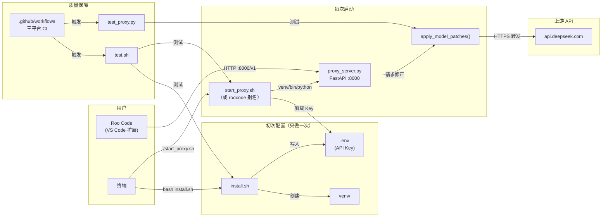

# RooCode Plus

Roo Code 的多模型适配层。解决 Roo Code 切换到不同模型时遇到的兼容性问题。目前适配了 DeepSeek，后续会覆盖更多模型。

[](LICENSE)
[](https://www.python.org/)

---

## 我应该看哪部分

| 你的情况 | 去看这里 |
|---|---|
| 没用过 VS Code，没用过终端，第一次接触 AI 编程 | [零基础教程](#零基础教程) |
| 还不知道怎么搞到 DeepSeek API Key（没注册、没充值） | [获取 DeepSeek API Key](#获取-deepseek-api-key) |
| 会用 VS Code 和终端，知道 venv/pip 是什么 | [专业用户快速上手](#专业用户快速上手) |
| 我是 Windows 用户，没用过 WSL | [各系统用户注意](#各系统用户注意) |
| 退出终端 / 关机后不知道怎么重新启动 | [再次运行指南](#再次运行指南) |
| 想了解安全模型，代码有没有埋坑 | [安全性说明](#安全性说明) |
| 已经启动了，要在 Roo Code 里配置 | [Roo Code 配置指南](#roo-code-配置指南) |
| 出错了 | [故障排除](#故障排除) |
| 想了解项目文件是干什么的 | [项目文件架构](#项目文件架构) |

---

## 各系统用户注意

本项目支持 Linux、macOS、Windows（通过 Git Bash）三个平台，但部分操作在不同系统上有差异。以下是你需要知道的：

### Windows 用户

**必须安装 Git Bash。** Windows 自带的命令提示符（cmd）和 PowerShell 不能运行本项目的脚本。

1. 去 [git-scm.com](https://git-scm.com/downloads/win) 下载 Git for Windows
2. 安装时一路默认选项即可
3. 安装完成后，在 VS Code 里按 `` Ctrl+` `` 打开终端，点击终端右上角的下拉箭头，选择「Git Bash」
4. 之后的所有命令都在 Git Bash 里输入

**别名不生效？** Windows 下 `roocode` 别名需要添加到 `~/.bashrc`（Git Bash 会自动加载），或者在 Git Bash 里输入 `source ~/.bashrc`。

**端口被防火墙拦截？** 首次启动代理时 Windows 可能会弹防火墙提示，必须点「允许」。

### macOS 用户

macOS 默认使用 zsh 而不是 bash。安装脚本会自动检测并写入 `~/.zshrc`。如果 `roocode` 别名不生效：

```bash
source ~/.zshrc
```

如果提示 `git: command not found`，终端输入：

```bash
xcode-select --install
```

### Linux 用户

如果你的系统缺少 `python3-venv` 包（Ubuntu/Debian 常见），在运行安装脚本之前先执行：

```bash
sudo apt install python3-venv -y
```

---

## 这个项目解决什么问题

Roo Code 默认使用的请求格式和很多模型的实际要求有偏差。具体表现：

- 模型不认识某些字段，直接返回 400
- 多轮对话时历史消息校验不通过，对话断掉
- thinking / reasoning_effort 这类参数没有被带上
- 上下文窗口利用率低，白花了 token 钱

RooCode Plus 在 Roo Code 和目标 API 之间做一层请求修正，把这些兼容性问题处理掉。

---

## 适配路线图

| 模型 | 状态 |
|---|---|
| DeepSeek (V4-Pro) | 已支持 |
| OpenAI (GPT-4o) | 计划中 |
| Anthropic (Claude) | 计划中 |
| Google (Gemini) | 待评估 |

欢迎 PR 贡献新模型适配器。

---

## 安全性说明

本地代理会处理你的 API 请求和代码上下文。以下是安全设计。

### 架构

- 默认只监听 `127.0.0.1:8000`，外网访问不到
- API Key 保存在项目内的 `.env` 文件中，由 [`start_proxy.sh`](start_proxy.sh) 自动加载。`.env` 已被 `.gitignore` 排除，不会被提交到 GitHub
- 请求直连 `api.deepseek.com`，中间不经过任何第三方
- 不存请求/响应内容。`proxy.log` 只记连接状态，不写对话正文
- 三个依赖（见 `requirements.txt`）：fastapi、httpx、uvicorn，没有隐藏的第四方包

### 自检方法

clone 下来之后自己跑两条命令确认：

```bash
# 确认代码里没有硬编码密钥
grep -n "sk-" proxy_server.py
# 仅匹配注释行（如 export DEEPSEEK_API_KEY="sk-xxx"），不是真实 key
# 实际代码中 API_KEY 默认值为空字符串

# 确认没监听公网
grep "host=" proxy_server.py
# 输出: host="127.0.0.1"
```

### Key 流经路径

```
.env 文件  →  source .env  →  os.environ.get()  →  Authorization Header  →  api.deepseek.com
```

全程 Key 不写入磁盘，不发第三方，不出日志。

### 风险边界

| 风险 | 等级 | 说明 |
|---|---|---|
| 本地恶意软件读环境变量 | 低 | 操作系统层面的事，和本项目无关 |
| 端口被局域网扫描 | 低 | 默认 127.0.0.1，不绑外网 IP |
| 日志泄露 | 极低 | 不记对话正文和 Key |
| 供应链攻击 | 极低 | 三个依赖都是 PyPI 顶级包 |

### 生产环境部署建议

```bash
# 用 systemd 管理，别用 nohup
# 通过 systemd EnvironmentFile 注入 Key，别写 ~/.bashrc
chmod 600 proxy.log
```

---

## 获取 DeepSeek API Key

### 零基础版

没在 DeepSeek 注册过的，跟着做。

**第一步：注册**

1. 浏览器打开 [platform.deepseek.com](https://platform.deepseek.com/)
2. 右上角点「登录 / 注册」
3. 手机号注册或者微信扫码都行

注意：platform.deepseek.com 和 chat.deepseek.com 是两个不同的站。我们用的是 platform，开发者平台，只有这里能拿 API Key。

**第二步：充值**

新账号没余额，得先充值才能调 API。门槛不高，几块钱就行。

1. 左侧菜单点「充值」或顶部「费用中心」
2. 输入金额。建议第一次充 10-20 块，自己用能撑很久
3. 微信或支付宝扫码付款

价格参考：deepseek-chat（V4-Pro）输入 2 元/百万 token，输出 8 元/百万 token。普通编程对话一次消耗几千到几万 token。

**第三步：创建 API Key**

1. 左侧菜单点「API Keys」
2. 点「创建 API Key」
3. 弹出来的窗口里那串 `sk-` 开头的东西就是你的 Key
4. 立刻复制保存。窗口关了就再也看不到了，只能删掉重建

Key 相当于密码，别发群里，别截图给别人。别人拿到就能用你的账户调 API，花你的余额。

### 专业版

1. 打开 [platform.deepseek.com](https://platform.deepseek.com/) 注册/登录
2. 充值页面充任意金额（建议 10+），扫码付款
3. API Keys 页面创建 Key，复制 `sk-` 开头的密钥

### 计费参考

| 模型 | 输入价格 | 输出价格 | 上下文窗口 |
|---|---|---|---|
| deepseek-chat (V4-Pro) | 2 元/百万 token | 8 元/百万 token | 1M token |
| deepseek-reasoner (R1) | 4 元/百万 token | 16 元/百万 token | 64K token |

1 百万 token 大概相当于三四本《三体》第一部的字数。

### 费用估算

| 使用量 | 月花费 |
|---|---|
| 偶尔用，每天问几个问题 | 5-10 元 |
| 高频，每天写不少代码 | 15-30 元 |
| 重度，全天开着干活 | 50-100 元 |

没有月费，没有最低消费，余额永久有效，用多少扣多少。

---

## 零基础教程

没碰过终端和命令行的，从这里开始。

### 准备工作

#### 什么是终端

终端就是你和电脑打字交流的地方。VS Code 里按 `` Ctrl+` ``（ESC 下面那个键），底部弹出来的窗口就是。

你会看到类似 `user@computer:~$` 的东西，光标在 `$` 后面闪，等着你输入。

> **Windows 用户：** 确保终端右上角显示的是「Git Bash」而不是「PowerShell」。如果显示 PowerShell，点下拉箭头切换到 Git Bash。还没装 Git Bash？看[各系统用户注意](#各系统用户注意)。

#### 确认有 Python

在终端里输入：

```bash
python3 --version
```

应该看到 `Python 3.10.12` 或类似的东西。数字低于 3.10 的话去 [python.org](https://www.python.org/downloads/) 下载安装。

上面的 `bash` 只是标记「这是终端命令」，不用打这三个字母。只输入 `python3 --version` 然后回车。

> **Linux 用户：** 如果提示 `python3: command not found`，试试 `python --version`。如果也不行，`sudo apt install python3 -y`（Ubuntu/Debian）或 `sudo yum install python3 -y`（CentOS/Fedora）。

#### 下载项目

一行一行来，每行输完回车，等跑完再输下一行：

```bash
cd ~
```

`cd` = 去某个地方，`~` = 你的个人文件夹。

```bash
git clone https://github.com/Tensor-0/roocode-plus.git
```

从 GitHub 把代码复制到电脑上。如果提示 `git: command not found`，看[故障排除](#故障排除)里的第一条。

```bash
cd roocode-plus
```

进入刚下载的文件夹。

### 一键安装

就一行：

```bash
bash install.sh
```

脚本会自动帮你完成以下事情：
1. 检查 Python 版本（需要 3.10+）
2. 创建虚拟环境
3. 安装依赖包
4. 让你输入 DeepSeek API Key，保存到项目里
5. 问你要不要添加 `roocode` 别名（建议同意）

安装过程中唯一需要你操作的就是输入 API Key（那串 `sk-` 开头的东西）。Key 在哪拿？看[获取 DeepSeek API Key](#获取-deepseek-api-key)。

> **macOS 用户：** 安装脚本会自动将别名写入 `~/.zshrc`（macOS 默认用 zsh）。安装完成后执行 `source ~/.zshrc` 使别名立即生效。
>
> **Windows 用户：** 别名写入 `~/.bashrc`（Git Bash 的配置文件）。安装完成后执行 `source ~/.bashrc` 使别名生效，或者关闭 Git Bash 重新打开。

### 启动

如果你在安装时同意添加了别名，以后任何时候在终端输入：

```bash
roocode
```

就启动了。四个字符，不需要 cd，不需要激活 venv，不需要输 Key。

> 如果提示 `command not found: roocode`：
> - **Linux：** `source ~/.bashrc`
> - **macOS：** `source ~/.zshrc`
> - **Windows：** `source ~/.bashrc` 或重开 Git Bash

如果没加别名，在项目目录下：

```bash
./start_proxy.sh
```

正常输出：

```text
============================================
  RooCode Plus — Multi-Model Adapter
============================================
[成功] RooCode Plus 已在后台启动！PID: 12345
       监听地址: http://127.0.0.1:8000/v1/chat/completions
```

启动了。去看 [Roo Code 配置指南](#roo-code-配置指南)。

---

## 专业用户快速上手

要求：Python >= 3.10，Linux / macOS / Windows (Git Bash)。

**推荐方式（一行安装，支持 `roocode` 别名）：**

```bash
git clone https://github.com/Tensor-0/roocode-plus.git && cd roocode-plus && bash install.sh
```

安装脚本会交互式引导输入 API Key（保存到 `.env`），并可选添加 `roocode` 别名。之后启动只需：

```bash
roocode
```

> Linux: 别名在 `~/.bashrc` / macOS: 别名在 `~/.zshrc` / Windows: 别名在 `~/.bashrc`（Git Bash）

**手动方式：**

```bash
git clone https://github.com/Tensor-0/roocode-plus.git
cd roocode-plus
python3 -m venv venv
venv/bin/pip install -r requirements.txt
echo 'DEEPSEEK_API_KEY=sk-xxxxxxxxxxxxxxxxxxxxxxxxxxxxxxxx' > .env
./start_proxy.sh
```

> Windows 手动安装时注意：venv 路径是 `venv/Scripts/pip.exe` 和 `venv/Scripts/python.exe`

---

## Roo Code 配置指南

### 打开设置

VS Code 左侧 Roo Code 面板（通常是一个机器人图标），展开后点右上角齿轮图标，进入 Provider Settings。

### 配置项

| 配置项 | 值 |
|---|---|
| API Provider | `OpenAI Compatible` |
| Base URL | `http://127.0.0.1:8000/v1` |
| API Key | 任意非空字符串（比如 `roocode-plus`） |
| Model ID | `deepseek-chat` |

### 验证

Roo Code 聊天框里发一条：

```
你好。当前使用的上下文窗口有多大？
```

正常的话你会看到模型的完整思考链输出。

### 数据流向

```
Roo Code  ---请求--->  RooCode Plus (127.0.0.1:8000)  ---修正后--->  目标模型 API
                              │
                    注入必需参数 / 补全缺失字段 / 修正消息格式 / 流式转发
```

---

## 再次运行指南

退出终端或关机后，代理进程就结束了。下次用时重新启动即可——虚拟环境和配置都在，不用重新装。

### 如果有别名（推荐）

安装时添加了 `roocode` 别名的用户，打开任意终端，输入：

```bash
roocode
```

四个字符，搞定。

（如果提示 `command not found: roocode`，执行 `source ~/.bashrc`（Linux/Windows Git Bash）或 `source ~/.zshrc`（macOS）使别名生效。）

### 如果没有别名

打开终端，进入项目目录启动：

```bash
cd ~/roocode-plus && ./start_proxy.sh
```

`start_proxy.sh` 会自动加载 `.env` 中的 Key 并使用虚拟环境的 Python，不需要手动 `export` 或 `source venv/bin/activate`。

### 忘了 API Key？

Key 保存在项目里的 `.env` 文件中。查看：

```bash
cat ~/roocode-plus/.env
```

如果 `.env` 不存在或 Key 不对，重新运行安装脚本即可：

```bash
cd ~/roocode-plus && bash install.sh
```

---

## 故障排除

### 1. 提示 'git' 未找到

`git: command not found`

没装 Git。

- Windows：去 [git-scm.com](https://git-scm.com/downloads/win) 下载，一路默认选项安装。
- macOS：终端输入 `xcode-select --install`。
- Linux (Debian/Ubuntu)：`sudo apt install git -y`。

装好后重开终端，`git --version` 确认。

### 2. 提示 'python3' 未找到

`python3: command not found`

试试 `python --version`（不带 3）。如果也不行，去 [python.org](https://www.python.org/downloads/) 下载安装。Windows 安装时一定勾选「Add Python to PATH」。

装好后关掉终端重新打开。

### 3. 漏步骤了

| 漏了哪步 | 出错的命令 | 补上 |
|---|---|---|
| 没运行安装脚本 | start_proxy.sh 找不到或 venv 缺失 | `bash install.sh` |
| 安装时没输入 Key | API 返回 401 | 重新运行 `bash install.sh` |

如果之前是手动安装出问题，直接跑 `bash install.sh` 即可——它会检测已有 venv 并跳过重复步骤，只让你补上 API Key。

### 4. 看错命令了

常见错误：

- 把 `roocode-plus` 打成 `roocode_plus`
- 把 `DEEPSEEK_API_KEY` 打成 `DEEPSEEK_APIKEY`
- 把 `sk-` 密钥里的 `I`（大写 i）看成 `l`（小写 L）或 `1`（数字 1）
- 把 `./start_proxy.sh` 打成 `./start proxy.sh`（加了空格）

出错了把你的命令和教程里逐个字符对比。

### 5. 网络问题

`pip install` 时出现 `Connection timeout` 或 `Network is unreachable`。

开了代理但代理有问题：

```bash
unset http_proxy https_proxy all_proxy
pip install -r requirements.txt
```

在国内没开代理：

```bash
pip install -i https://pypi.tuna.tsinghua.edu.cn/simple -r requirements.txt
```

### 6. Roo Code 连不上代理

逐项查：

```
[1] 代理还在运行吗？
    ps aux | grep proxy_server
    没输出就是挂了，重新启动：roocode 或 ./start_proxy.sh

[2] Base URL 对吗？
    http://127.0.0.1:8000/v1
    不是 https，不是 localhost，就是 127.0.0.1

[3] 防火墙拦了？
    Windows 首次启动时如果弹防火墙提示，要点「允许」

[4] 代理端报错了？
    tail -20 proxy.log
```

### 7. API 返回 401

`[API 报错] 状态码: 401`

Key 没设对。检查 `.env` 文件：

```bash
cat ~/roocode-plus/.env
# 如果 Key 不对，重新运行安装脚本设置：
cd ~/roocode-plus && bash install.sh
# 然后重启代理：roocode
```

检查 Key 里是不是混了空格。

### 8. API 返回 400

`[API 报错] 状态码: 400`

- Roo Code 里的 Model ID 必须填 `deepseek-chat`，不是别的
- Base URL 必须是 `http://127.0.0.1:8000/v1`，末尾不要再加路径
- Roo Code 侧的 API Key 随便填个非空字符串就行

### 9. 电脑关机后连不上了

这是正常的——代理进程关机会结束。重新启动：

```bash
roocode
```

如果没加别名：

```bash
cd ~/roocode-plus && ./start_proxy.sh
```

虚拟环境和 Roo Code 配置都在，不用重新装。

### 10. 端口被占用

`OSError: [Errno 98] Address already in use`

```bash
# 杀掉占用 8000 端口的进程
kill $(lsof -t -i:8000) 2>/dev/null
./start_proxy.sh

# 或者换端口：改 proxy_server.py 最后一行的 port=8000，
# Roo Code 的 Base URL 跟着改
```

> **Windows 用户：** 用 `netstat -ano | findstr 8000` 查看谁占用了端口，然后用 `taskkill //F //PID 进程号` 杀掉。

### 11. Permission Denied

`bash: ./start_proxy.sh: Permission denied`

```bash
chmod +x start_proxy.sh
```

> **Windows 用户：** Git Bash 下通常不会遇到此问题。如果遇到，用 `bash start_proxy.sh` 替代 `./start_proxy.sh`。

### 12. roocode 别名无效

`command not found: roocode`

新添加的别名需要重新加载 shell 配置才能生效：

```bash
source ~/.bashrc   # Linux / Windows Git Bash
source ~/.zshrc    # macOS（默认用 zsh）
```

**怎么判断自己用的是 bash 还是 zsh？** 终端里输入 `echo $SHELL`。输出 `/bin/bash` 用 `.bashrc`，输出 `/bin/zsh` 用 `.zshrc`。

如果还是不行，确认别名已添加：

```bash
grep roocode ~/.bashrc ~/.zshrc 2>/dev/null
```

没有输出的话手动添加：

```bash
# Linux / Windows Git Bash
echo "alias roocode='cd ~/roocode-plus && ./start_proxy.sh'" >> ~/.bashrc
source ~/.bashrc

# macOS
echo "alias roocode='cd ~/roocode-plus && ./start_proxy.sh'" >> ~/.zshrc
source ~/.zshrc
```

### 13. 虚拟环境找不到

启动脚本提示 `[错误] 未检测到 Python 虚拟环境`

直接运行安装脚本，它会自动创建：

```bash
bash install.sh
```

### 14. DNS 解析失败

`[API 报错] ... Name or service not known`

先确认网是不是通的：

```bash
curl -I https://api.deepseek.com
```

如果不通，检查代理设置（参考故障 5）。在国内没开代理的话 DeepSeek API 可能被墙。

### 15. Roo Code 找不到配置项

Roo Code 版本太旧或者界面布局有差异。先更新 VS Code 和 Roo Code 扩展。核心原则不变：找 Provider 设置 -> 选 OpenAI Compatible -> 填 Base URL 和 Model ID。

### 16. 配置完 Roo Code 没反应

发消息后没输出也没报错。

```bash
tail -f ~/roocode-plus/proxy.log
# 再发一条消息，看日志有没有新输出
# 没有 = Roo Code 根本没连到代理
```

检查：
- API Provider 是不是 `OpenAI Compatible`
- Base URL 是不是 `http://127.0.0.1:8000/v1`
- URL 前有没有多打空格
- Roo Code 有没有选错 Profile

---

## 项目文件架构

### 文件分组

| 分组 | 文件 | 用途 | 你什么时候会碰到它 |
|------|------|------|---------------------|
| 运行核心 | [`proxy_server.py`](proxy_server.py) | FastAPI 适配代理，拦截请求 → 参数修正 → 转发 | 改适配逻辑、加新模型 |
| | [`start_proxy.sh`](start_proxy.sh) | 一键启动脚本，自动加载 `.env` 和 venv | 每次启动代理（或通过 `roocode` 别名） |
| | [`install.sh`](install.sh) | 一键安装：Python 检测 → venv → pip → `.env` → 别名 | 第一次配置，或换了电脑 |
| 依赖声明 | [`requirements.txt`](requirements.txt) | 运行依赖：fastapi、httpx、uvicorn | 手动安装时 `pip install -r` |
| | [`requirements-dev.txt`](requirements-dev.txt) | 测试依赖：pytest、pytest-httpx、pytest-asyncio | 跑单元测试前 `pip install -r` |
| 测试体系 | [`test.sh`](test.sh) | bash 集成测试（/tmp 隔离，4 个场景） | 改了脚本后本地验证 |
| | [`test_proxy.py`](test_proxy.py) | pytest 单元测试（13 用例，mock 上游 API） | 改了 `proxy_server.py` 后跑 |
| | [`.github/workflows/test.yml`](.github/workflows/test.yml) | GitHub Actions CI，三平台自动跑 | push 代码后 GitHub 自动触发 |
| 工程配置 | [`.gitignore`](.gitignore) | 排除 `venv/`、`.env`、`*.log`、`__pycache__/` | 不会手动碰 |
| | [`.clinerules`](.clinerules) | 本项目代码规范 | 贡献代码时参考 |
| | [`README.md`](README.md) | 就是本文档 | 任何时候 |

### 架构与调用关系



**调用链路说明：**

1. [`install.sh`](install.sh) 创建 `venv/` 并将 API Key 写入 `.env`（已在 `.gitignore` 排除）
2. [`start_proxy.sh`](start_proxy.sh) 启动时自动 `source .env` 加载 Key，用 `venv/bin/python` 运行 [`proxy_server.py`](proxy_server.py)
3. [`proxy_server.py`](proxy_server.py) 收到 Roo Code 的请求后，调用 [`apply_model_patches()`](proxy_server.py:55) 修正参数，然后转发到 `api.deepseek.com`
4. Roo Code 在 VS Code 中将 `http://127.0.0.1:8000/v1` 设为 Base URL，所有对话请求经本地代理中转

**测试链路说明：**

- [`test.sh`](test.sh) 在 `/tmp` 下创建隔离环境，验证 [`install.sh`](install.sh) 和 [`start_proxy.sh`](start_proxy.sh) 的 happy path + 错误场景
- [`test_proxy.py`](test_proxy.py) 用 pytest + mock 验证 [`apply_model_patches()`](proxy_server.py:55) 的 9 种输入组合和 2 种端点行为
- [`.github/workflows/test.yml`](.github/workflows/test.yml) 每次 push/PR 在 ubuntu、macOS、Windows 三平台自动运行以上全部测试

---

## 贡献新模型适配器

`proxy_server.py` 的 `apply_model_patches()` 函数设计为可扩展的。适配器通过 `CURRENT_MODEL_PREFIX` 常量匹配模型名，仅对目标模型注入参数。

加新适配只需三步：

1. 在 `apply_model_patches()` 中添加模型检测分支
2. 更新 `TARGET_URL` 指向新模型的 API 端点
3. 设置对应的环境变量读取新模型的 API Key

示例：添加 Claude 适配

```python
# 1. 修改 CURRENT_MODEL_PREFIX（或改为运行时判断）
CURRENT_MODEL_PREFIX = "claude"  # 或同时支持多个前缀

# 2. 在 apply_model_patches() 中添加分支
def apply_model_patches(body: dict) -> dict:
    model = body.get("model", "")

    if "deepseek" in model.lower():
        body.setdefault("thinking", {"type": "enabled"})
        body.setdefault("reasoning_effort", "high")

    elif "claude" in model.lower():
        body["anthropic_version"] = "2023-06-01"
        body.setdefault("max_tokens", 4096)

    elif "gemini" in model.lower():
        body.setdefault("safety_settings", [])

    # ... 通用修复逻辑 ...
    return body

# 3. 更新 TARGET_URL 和 API_KEY
TARGET_URL = "https://api.anthropic.com/v1/messages"
API_KEY = os.environ.get("ANTHROPIC_API_KEY", "")
```

更多模型支持计划见上方[适配路线图](#适配路线图)。

---

## License

MIT License

---

如果这个项目解决了你的问题，给个 Star。
